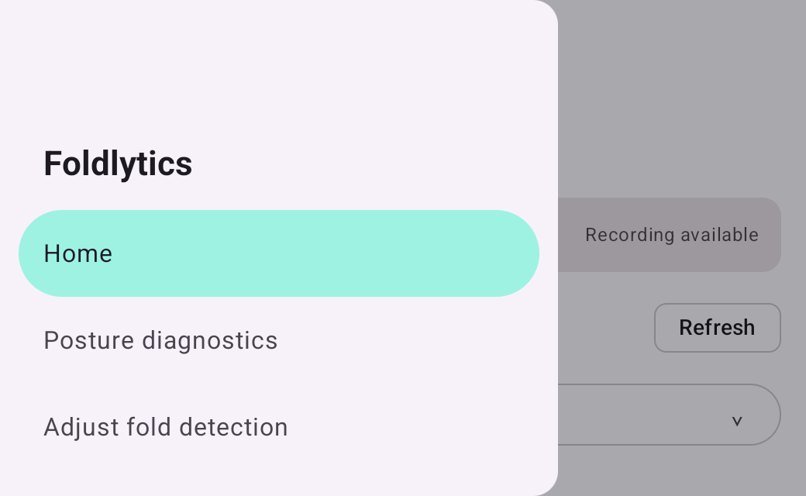
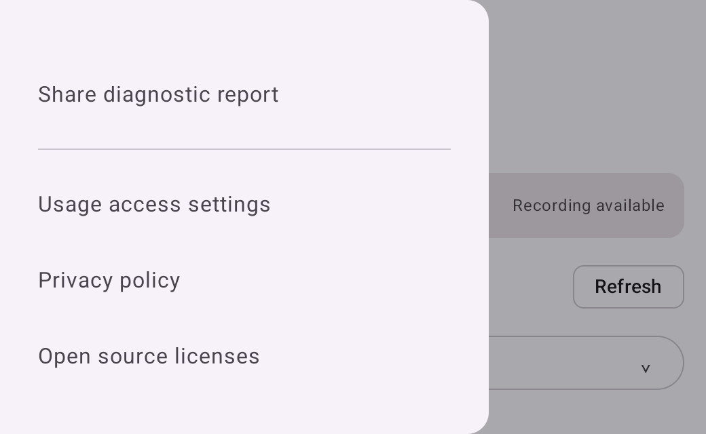
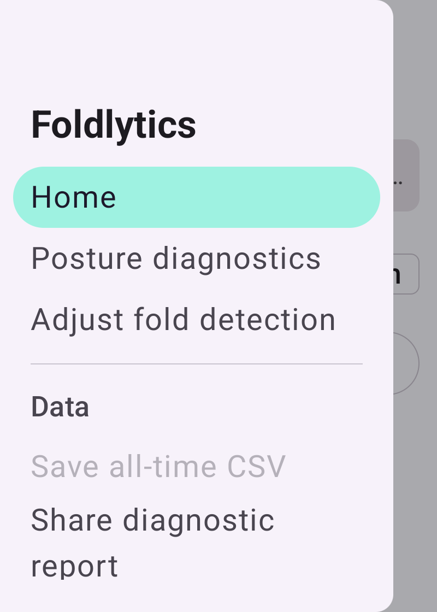
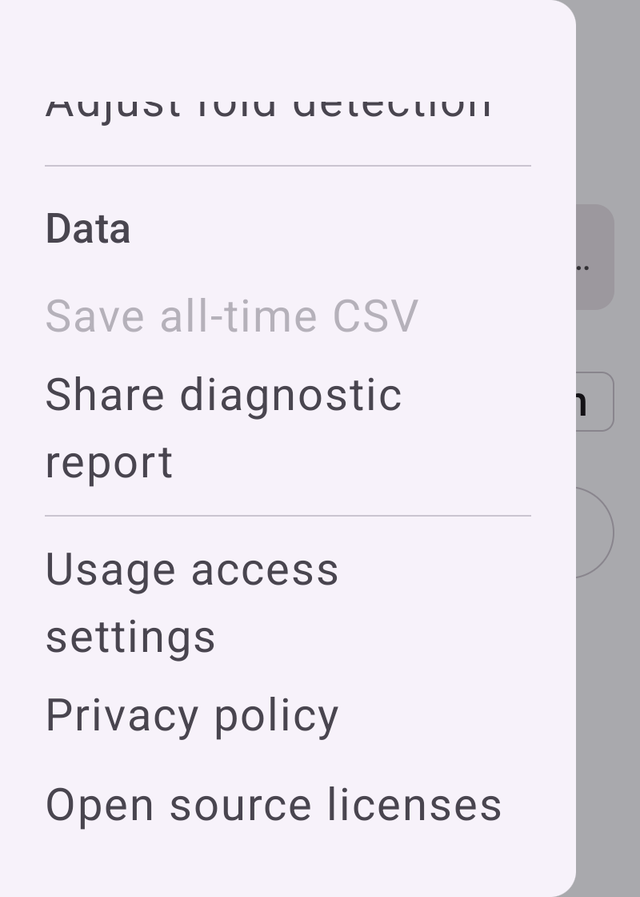

# Navigation drawer overflow: before and after

The navigation drawer listed every destination and action in a non-scrolling column, so a short
window (landscape or split screen) or a large font scale pushed the lower actions — usage access,
privacy policy, open source licenses — and the privacy note outside the sheet with no way to reach
them. The drawer content now scrolls, and the privacy note keeps its bottom placement whenever the
content still fits. The closed sheet stays composed, so scrolling is enabled only while the drawer
is visible and the drawer never advertises a scroll action behind the current screen.

## Capture settings

- Device: `Foldlytics_Pixel_9_Pro_Fold_API_36` AVD, Android API 36, headless, CLOSED display.
- Source: `DrawerOverflowScreenshotCaptureTest` (androidTest only), synthetic empty `MainUiState`
  with usage access granted. No user usage history is read or shown.
- Locale: English. Density fixed at 2.0 so the images stay comparable between runs.
- Short window: 520 × 320 dp (1040 × 640 px), font scale 1.0.
- Large text: 400 × 560 dp (800 × 1120 px), font scale 2.0.
- Before: `9d84c05` (drawer without scrolling). After: this branch.

## Short window (520 × 320 dp, font scale 1.0)

| Before | After | After, scrolled to the end |
| --- | --- | --- |
|  |  |  |

Before, the drawer stops at the first divider: the data, privacy, and license actions are unreachable.
After, the same first screen scrolls down to every remaining action.

## Large text (400 × 560 dp, font scale 2.0)

| Before | After | After, scrolled to the end |
| --- | --- | --- |
|  |  |  |

## Regression coverage

`FoldlyticsDrawerTest` runs the drawer in the same constrained windows and fails without the fix:

- `reachesEveryDrawerActionInAShortWindow` scrolls to and clicks the privacy policy and open source
  licenses items at 520 × 320 dp.
- `reachesTheLastDrawerActionAtLargeFontScale` scrolls to and clicks the last action at font scale 2.0.
- `keepsThePrivacyNoteAtTheBottomWhenTheDrawerFits` guards the unchanged tall-window layout.

## Reproducing the captures

```
./gradlew connectedDebugAndroidTest \
  -Pandroid.testInstrumentationRunnerArguments.class=com.nagopy.android.foldlytics.ui.DrawerOverflowScreenshotCaptureTest
adb pull /sdcard/Download/Foldlytics/drawer-overflow-review/
```

Delete the device directory between runs; the instrumentation reinstall loses ownership of the
previous files, so MediaStore otherwise keeps them and adds `(1)` to the new names.
