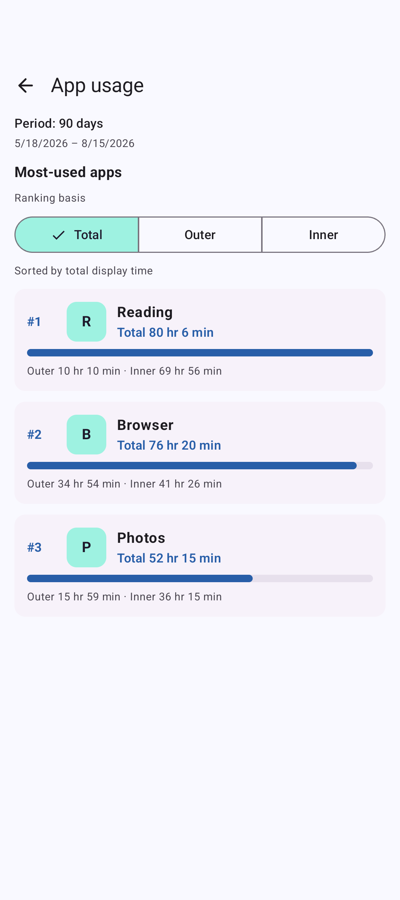
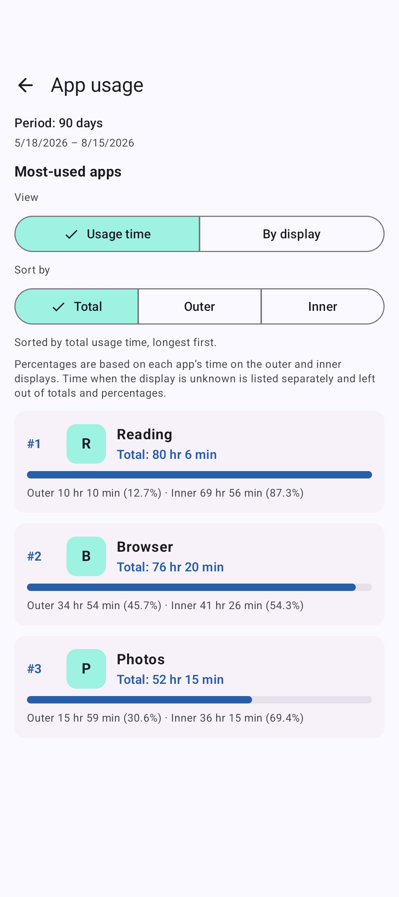
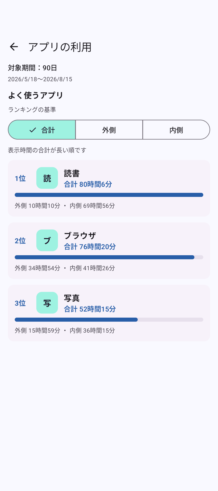
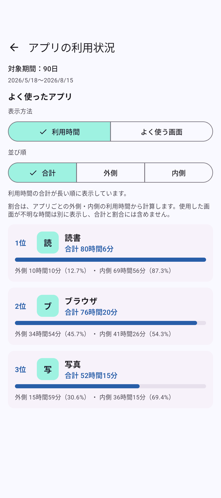
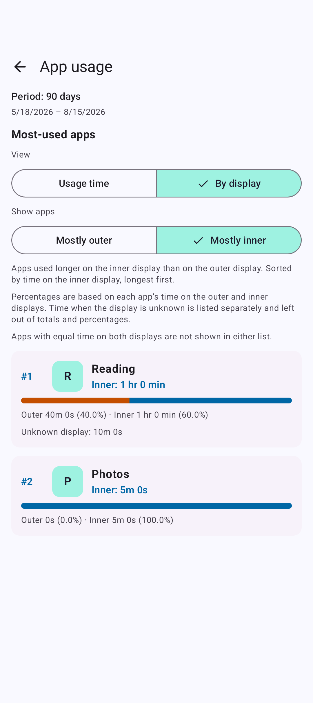
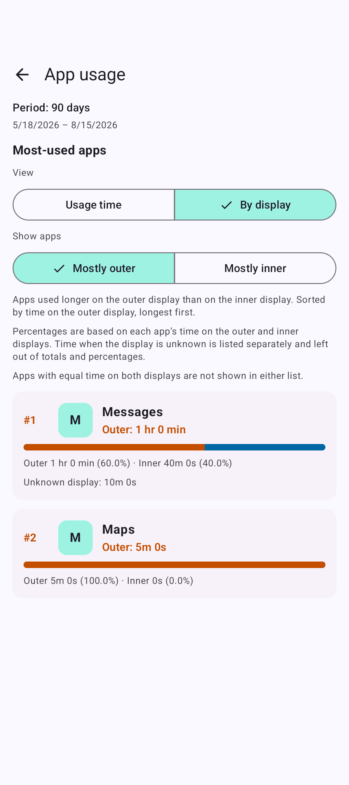
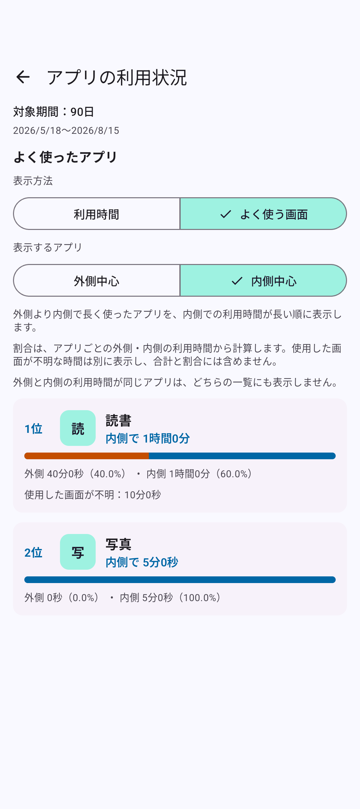
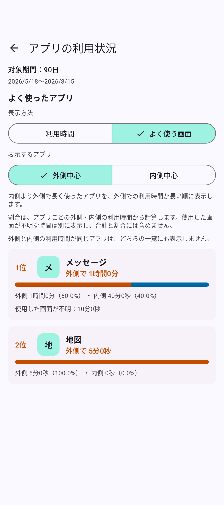

# PR #16 app-ranking comparison

These unmodified screenshots use synthetic, in-memory data from
`StoreScreenshotCaptureTest`, with generic app names and no user usage history.

- Before: main at `dc12e5b8a010cd63c660faf027be0f8f6346fc2b`.
- After: integrated PR #16 at `a8816497d8f179f1efbd29b6c062d6d196e79bbb`.
- After-capture device: `Foldlytics_PR16_Copy_20260905` foldable AVD, Android API 36,
  CLOSED (state 0), 1080 × 2424 pixels, 390 dpi, font scale 1.0, awake and unlocked.

## Total ranking: same data before and after

The four total-ranking captures use the same existing 90-day synthetic dataset. The after
view adds the Usage time / By display selector, an explanation of unknown time, and per-app shares;
the ranking order and measured durations remain the same.
The even-split exclusion note appears only in By display, where it applies.

| Locale | Before | After |
| --- | --- | --- |
| English |  |  |
| Japanese |  |  |

## New display-share view: separate synthetic examples

The share captures use a separate dataset to make the behavior visible. Reading has 60 minutes
inner / 40 minutes outer and ranks ahead of Photos' 5 minutes of inner-only use. Messages has
60 minutes outer / 40 minutes inner and ranks ahead of Maps' 5 minutes of outer-only use.
Reading and Messages each show 10 minutes of display-undetermined time outside their shares.
Browser's even split belongs to neither majority list. These values are not a before/after
comparison with the total-ranking dataset above.

| Locale | Mostly inner / 内側中心 | Mostly outer / 外側中心 |
| --- | --- | --- |
| English |  |  |
| Japanese |  |  |

## Japanese and English copy review

The copy now names both displays in the comparison, explains the ordering by usage time,
and distinguishes unknown-display time from each app's total and percentages.
The calculation, filtering, and ranking logic did not change during this copy revision.

| Previous Japanese | Revised Japanese | Previous English | Revised English |
| --- | --- | --- | --- |
| 画面割合 | よく使う画面 | Display share | By display |
| 内側が高い / 外側が高い | 内側中心 / 外側中心 | Inner higher / Outer higher | Mostly inner / Mostly outer |
| 判定時間合計 | 合計 | Classified total | Total |
| 画面判定不能 | 使用した画面が不明 | Display undetermined | Unknown display |

The coordinator also validated the UI on the OPENED display (state 2, 2076 × 2152 pixels),
with no clipping found in either state at font scale 1.0. At font scale 2.0 on CLOSED, the
changed Japanese and English selectors remained readable; longer descriptions and card details
wrap and can be scrolled. The English selector was shortened to By display after the initial
Most-used display label wrapped and produced unequal button heights at 2.0.

The eight PNGs here are the CLOSED, font-scale-1.0 captures; no opened or large-text captures
are included. Synthetic UI checks do not establish real sensor accuracy: physical-device
usage access, calibration, and hinge sensing remain unverified.

Validation at the after-source: 142 JVM tests passed; lint reported zero errors and nine existing
warnings; both APK builds passed. The full connected suite passed 83/83 on CLOSED, and direct
instrumentation of `AppUsageScreenTest` plus `StoreScreenshotCaptureTest` passed 12/12 on OPENED.
The two Japanese/English display-share capture tests also passed at font scale 2.0 on CLOSED.
The coordinator reviewed the revised wording and captures in both languages, including the
comparison direction, empty states, unknown-time explanations, and accessible descriptions.

See [capture instructions](../../../store-assets/google-play/README.md#display-share-review-screenshots).
