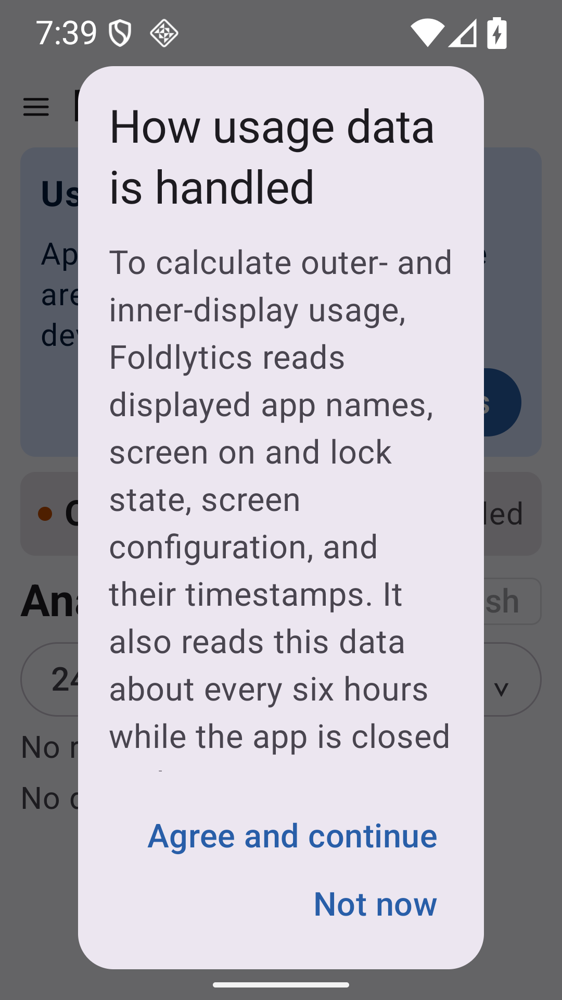
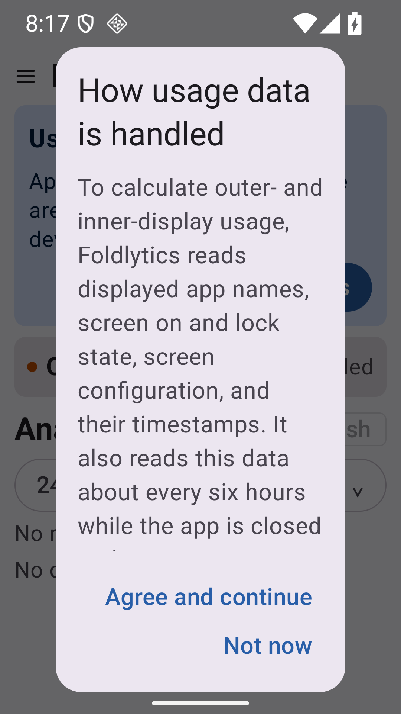
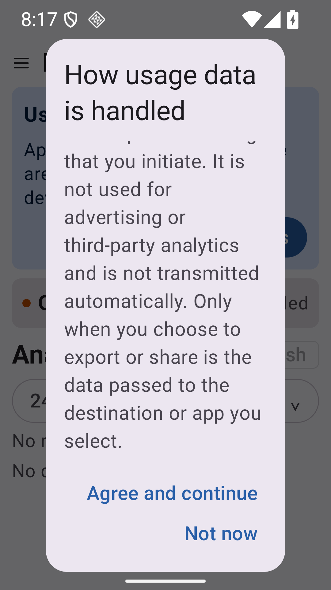

# 1.2.0 release review

Usage-access disclosure on the Pixel 9 Pro Fold AVD, Android 16 (API 36),
1080 × 1920 pixels at 390 dpi, English, with the system font scale set to 2.0.
The app has no Usage Access permission and no recorded usage history.

| Before | After: start | After: end |
| --- | --- | --- |
|  |  |  |

The before image was captured during the release review on the base revision
`fa8719c`. The after images use this PR's debug APK. Font scale was restored to
1.0 after capture; display size, density, and Usage Access were unchanged.

The same end-of-body check was also performed in Japanese at font scale 2.0:
[Japanese disclosure after scrolling](after-disclosure-large-font-ja-scrolled.png).
The temporary Japanese app locale was restored to the original system default
(English) after capture.

Automated regression tests also cover Japanese, constrained dialog height,
and scrolling to the end while both actions remain accessible.
