# Summary widget and chart consistency review

Device: Foldlytics Pixel 9 Pro Fold AVD, Android 16 / API 36, opened display at
1080 × 1920 pixels, 390 dpi. All usage values in these captures are synthetic.
The widget fixtures render real native `RemoteViews`; they are not design mockups.

## Home and shared image

Home before images are the checked-in 1.2.1 store captures. The share before image
was captured with the pre-change debug APK. After images use 1.3.0 (version code 10).

| Surface | Before | After |
| --- | --- | --- |
| Home, Japanese | 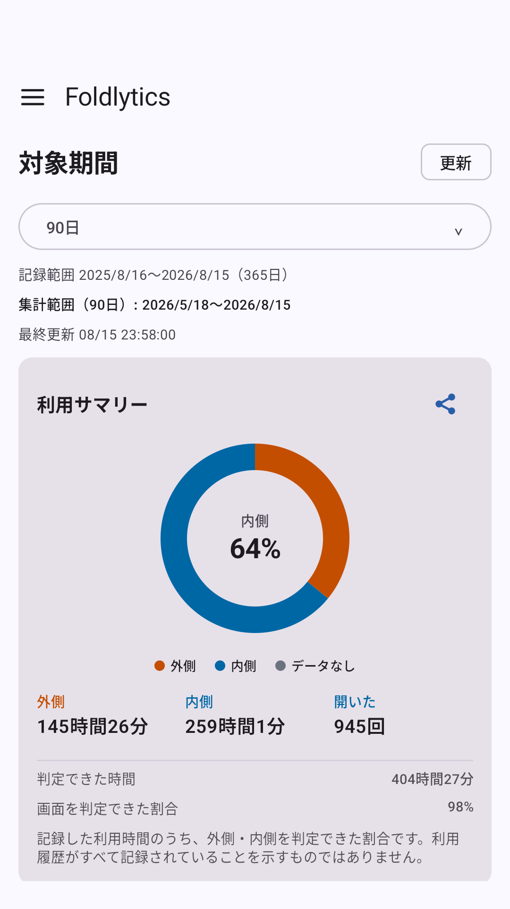 | 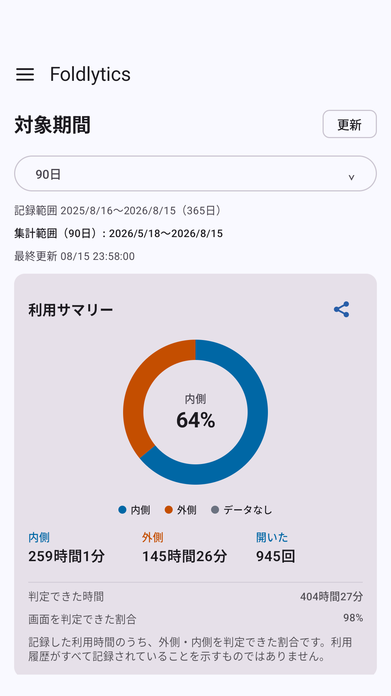 |
| Home, English | 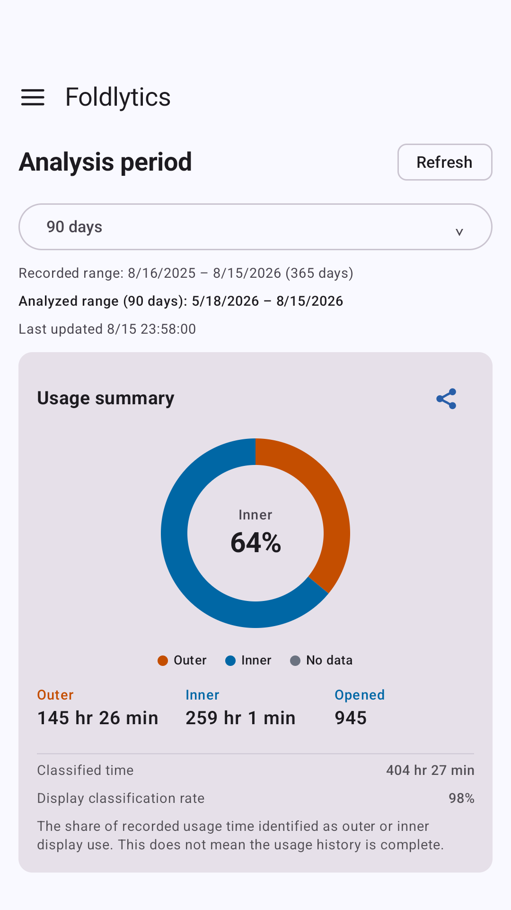 | 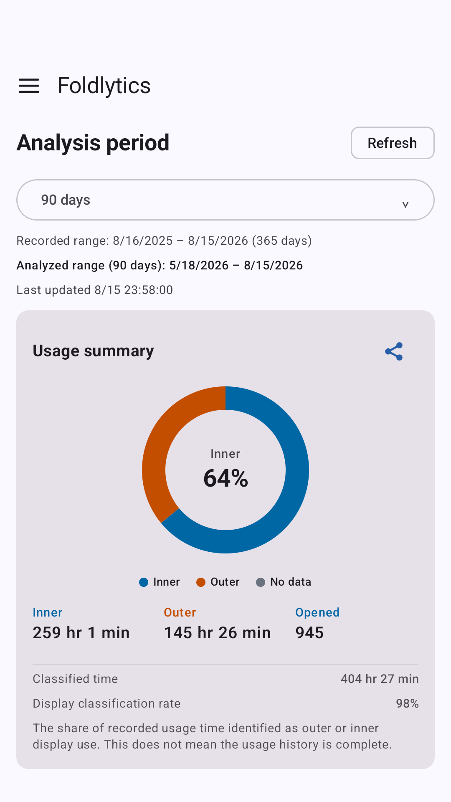 |
| Shared image, Japanese | 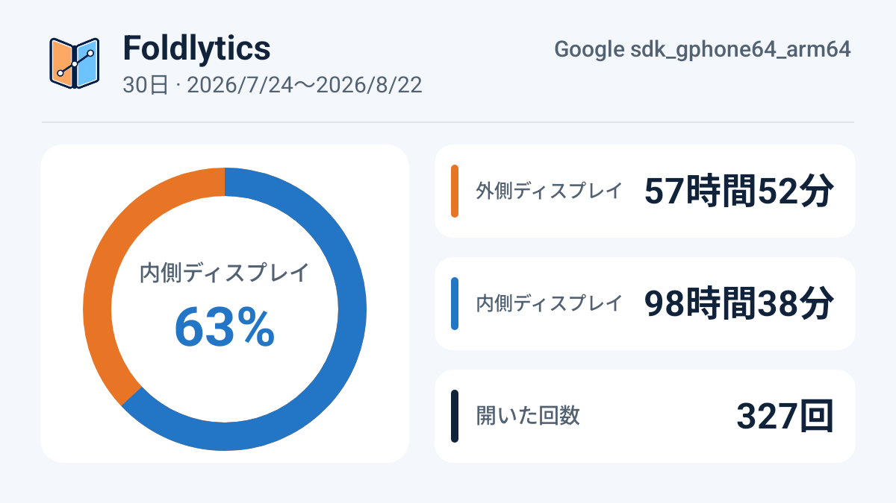 | 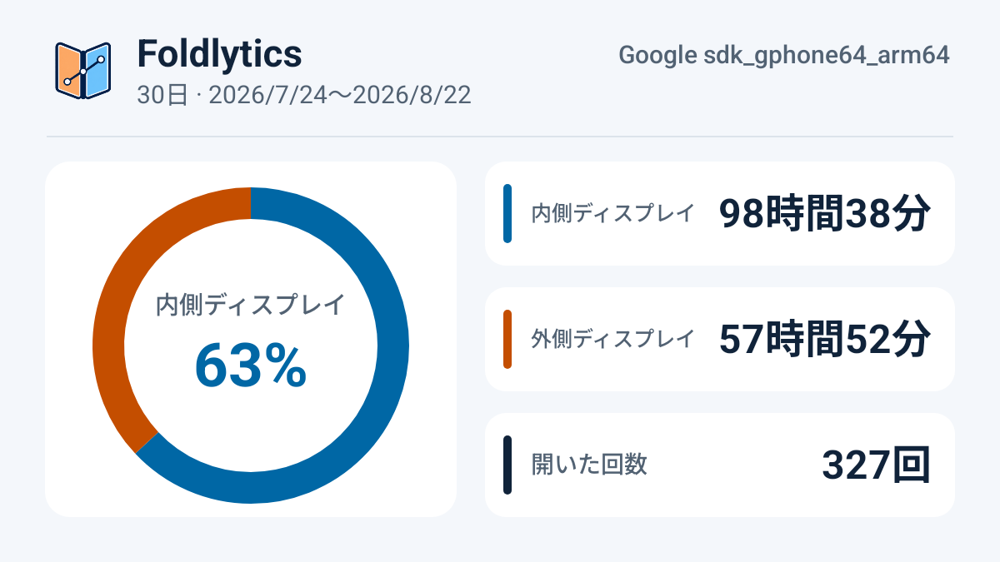 |

The inner segment now starts at 12 o'clock and runs clockwise on all three surfaces.
Home legends and metrics, and shared-image metrics, list inner before cover.
The share image uses the same light palette as the home chart.

## Widget layouts

Fixtures cover the minimum 140 × 180 dp small layout and 280 × 180 dp wide layout.
Actual launcher cell counts depend on grid and display settings. Tapping the period
opens widget configuration; the refresh icon requests a sync; the body opens the app.
Larger system text settings use a text summary to preserve legibility. If the system
font size changes before the next widget update, the existing chart layout also
automatically sizes its text to fit when the launcher reinflates it.

| Locale | Small, light | Wide, light | Wide, dark |
| --- | --- | --- | --- |
| Japanese | 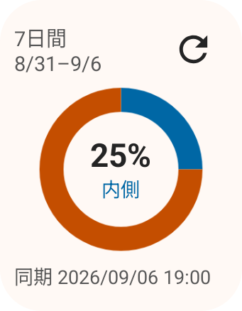 | 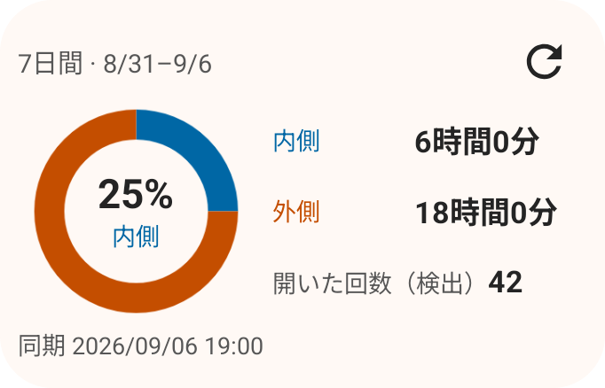 | 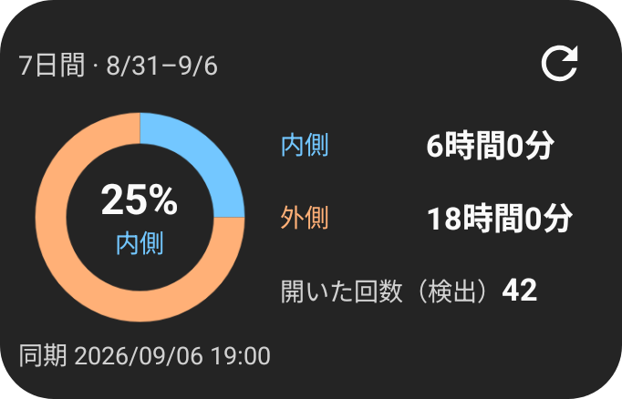 |
| English | 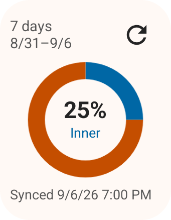 | 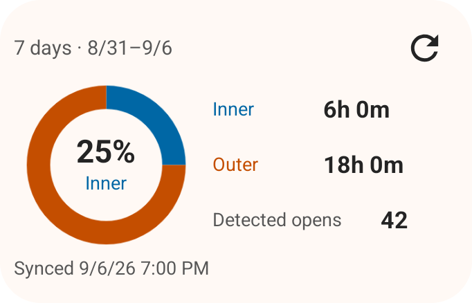 | 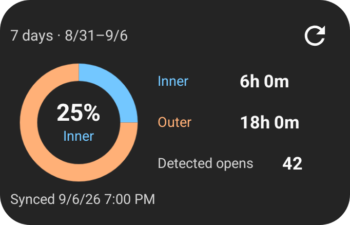 |

| Edge case | Capture |
| --- | --- |
| No classified data | 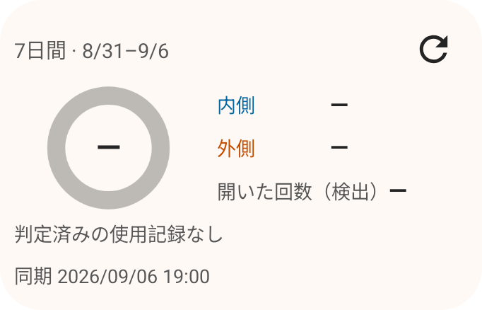 |
| Usage Access required | 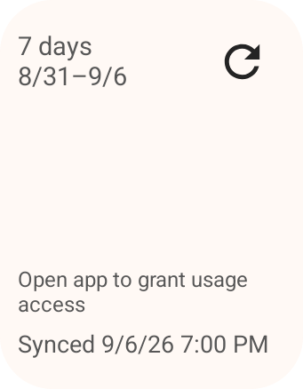 |
| Failed update, larger text | 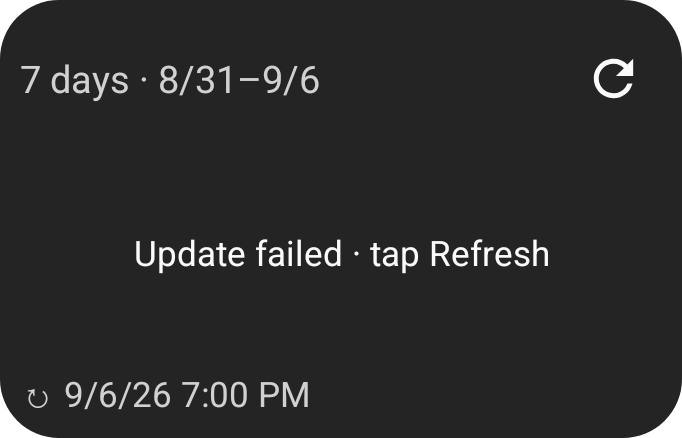 |
| 2× system text, Japanese |  |
| 2× system text, permission required | 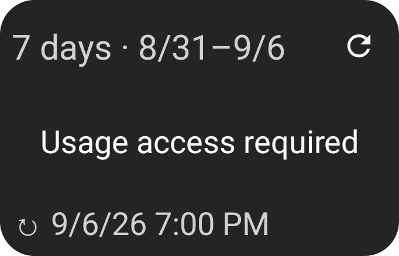 |

## Host font changes between updates

These captures reuse a payload created at standard text size. The launcher host
reinflates it with the changed font setting before another widget update occurs.

| 2× Japanese, failed update | 2× English, failed update | Small system text, 100% inner |
| --- | --- | --- |
| 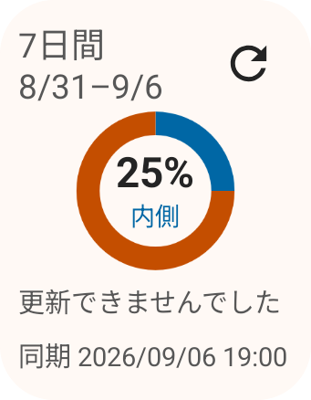 | 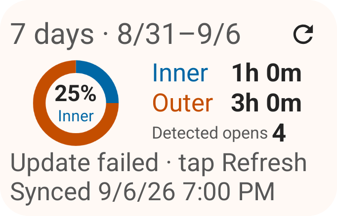 | 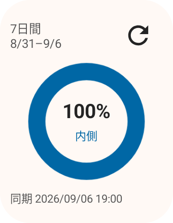 |

## Configuration on short screens

The period configuration scrolls within the safe drawing area, so the Save action
remains reachable in landscape and with larger system text. These captures show
the form after scrolling to Save in a constrained 520 × 240 dp test window.

| English, standard text | Japanese, 2× text |
| --- | --- |
| 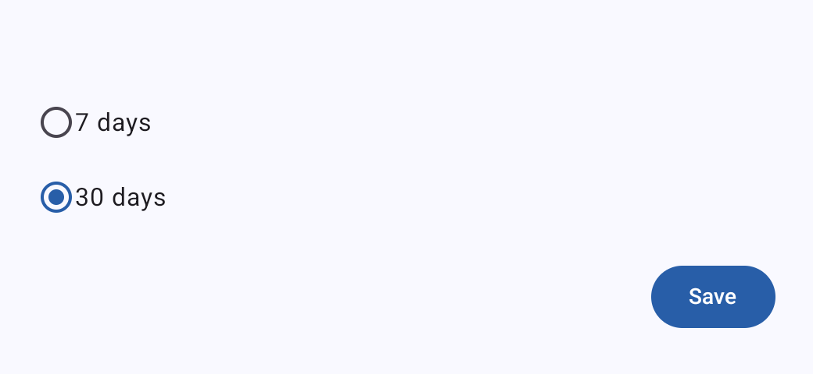 | 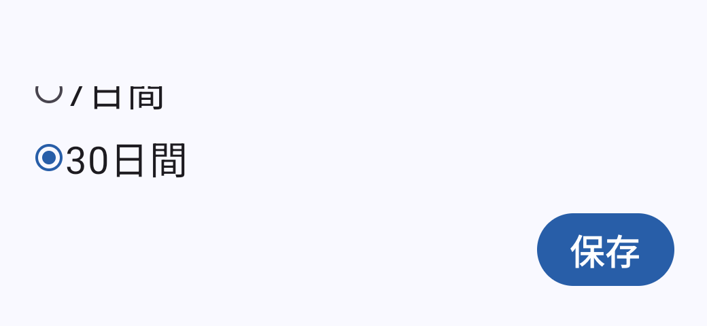 |

## Reproduction

Use JDK 17, SDK 36, and a disposable emulator. Do not run connected tests on a phone
holding real usage history. Run `SummaryWidgetScreenshotTest` through
`connectedDebugAndroidTest` or the installed AndroidJUnitRunner; it creates 96 PNGs
in the target app's external-files `summary-widget-review/` directory, combining
Japanese/English, light/dark, small/wide, font scales 1.0/1.3/2.0, and four data states.
Only representative images are committed here.

`SummaryWidgetRenderingTest` additionally verifies permission-to-ready reapplication
and re-inflation of the same light-created payload in a dark host, including actual
arc pixels, and a standard-text payload reinflated by a host with 0.85×, 1×, and 2× text, checking 48 combinations and 348 visible text fields
for clipping, overlap, and donut-center containment.
`SummaryWidgetConfigurationTest` verifies selecting and saving a period in short
English and large-text Japanese windows, and saves the configuration captures.
`SummaryWidgetBindingTest` uses two real AppWidgetHost IDs to verify
independent settings and refresh without an Activity, then deletes only its test host.

The store image workflow is documented in
[Google Play assets](../../../store-assets/google-play/README.md).
Physical fold/unfold sensing and manufacturer-specific background restrictions
remain outside this emulator review.
