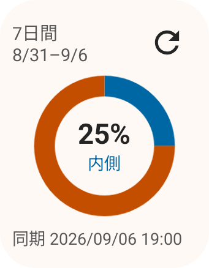
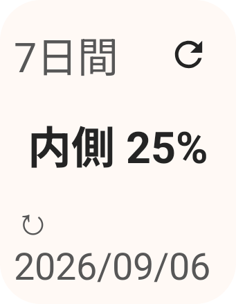
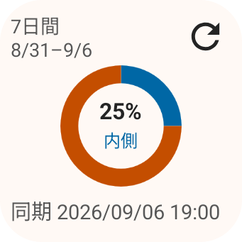
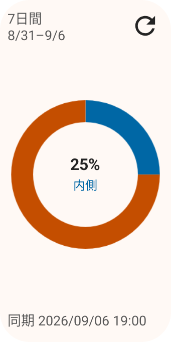
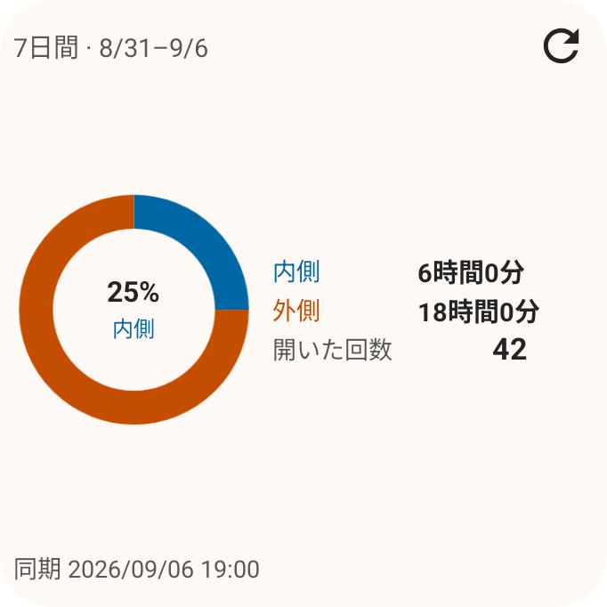
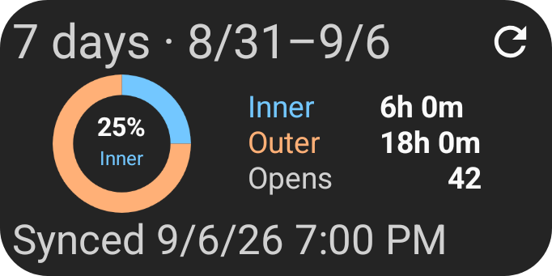
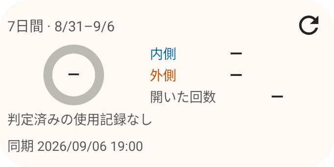
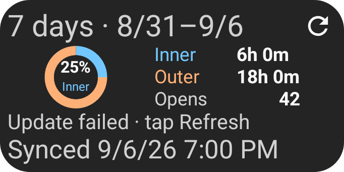
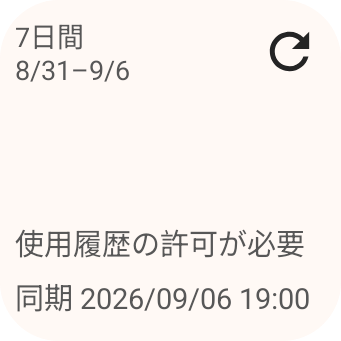

# Compact widget layout

Native RemoteViews captures on the Pixel 9 Pro Fold emulator, Android 16 / API 36,
390 dpi. Values are synthetic. Launcher cell dimensions depend on the home-screen grid;
the provider now requests 2×2 cells and allows resizing to 140×140 dp.

The narrow widget keeps its donut at every system font setting. The wide widget groups
inner time, cover time, and opens beside the chart. Increasing widget height does not
increase the spacing between metric rows. The opens label no longer includes “detected”.

| Layout | Before | After |
| --- | --- | --- |
| Narrow |  |  |
| Wide |  |  |
| Large system text |  |  |

| Taller narrow | Taller wide | English, dark |
| --- | --- | --- |
|  |  |  |

| No data | Update failed | Permission required |
| --- | --- | --- |
|  |  |  |

`SummaryWidgetScreenshotTest` generates 288 fixtures: two widths, three heights
(140/180/280 dp), two locales, two themes, three font sizes, and four data states.
`SummaryWidgetRenderingTest` checks actual arc pixels, permission-state reapplication,
host theme/font changes, text bounds, donut-center containment, and fixed metric spacing.
The font-change matrix checks 180 combinations and 1,152 visible text fields, including
permission-required states.
Physical device and manufacturer launcher behavior remain unverified for this update.
