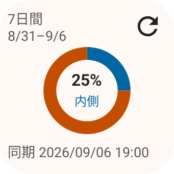
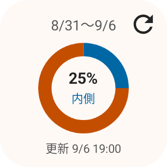
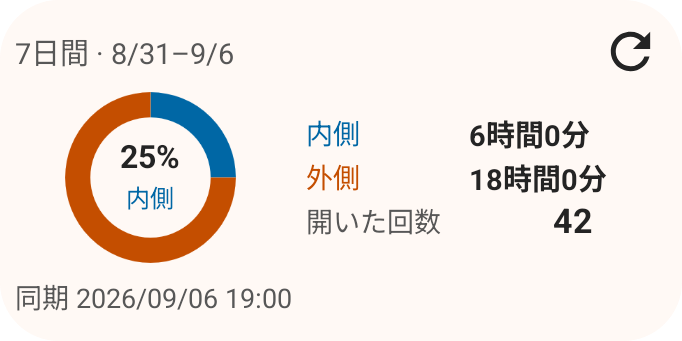
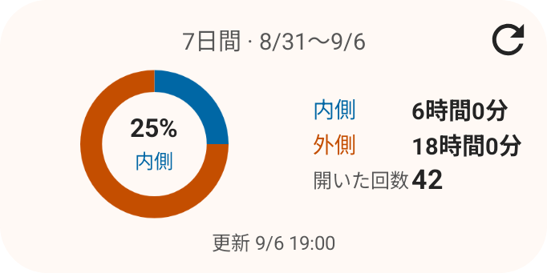
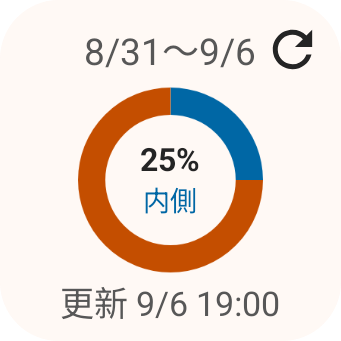
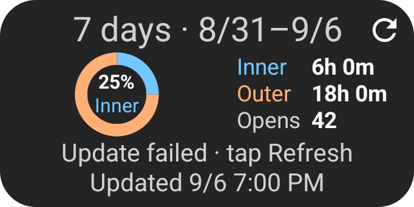

# Widget calendar periods

Native RemoteViews captures on the Pixel 9 Pro Fold emulator, Android 16 / API 36,
390 dpi. All values are synthetic. The before images were built from `42e93c4`.
The compact fixture is 140 × 140 dp; the wide fixture is 280 × 140 dp.

The compact header has one centered line containing the recorded date range, or
“Today” for today's calendar period. The update time is centered below the donut.
The selected 7/30-day preset remains available in the configuration screen and
accessibility description even when only part of that period has been recorded.

| Size | Before | After |
| --- | --- | --- |
| 2×2 |  |  |
| Wide |  |  |

| Large system text | Update failed, English/dark |
| --- | --- |
|  |  |

`SummaryWidgetScreenshotTest` captures both widths, three heights, two locales,
two themes, three font scales, and four data states. `SummaryWidgetRenderingTest`
checks text bounds, donut-center containment, host font/theme changes, period
labels, stale Today, and update timestamps.

Physical foldable sensing, manufacturer launcher layouts, and real-device usage
permission flows remain unverified for this change.
